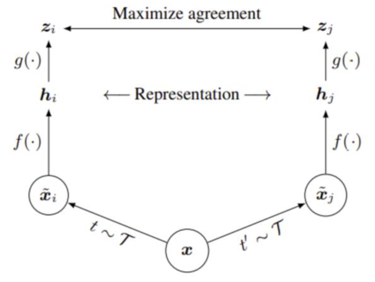
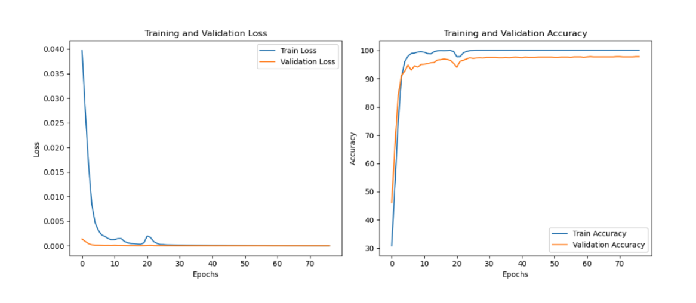
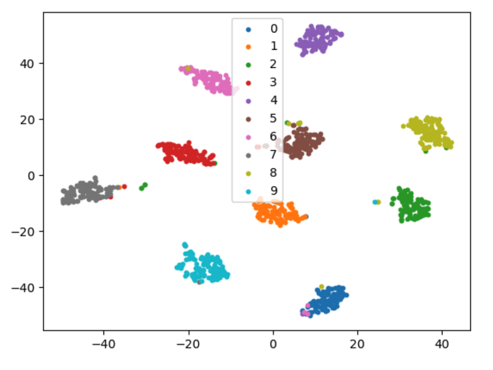

# SimCLR for MNIST Image Classification

## Introduction
This project aims to perform image classification in a limited data environment using the **MNIST** dataset with **Self-Supervised Learning** and **Contrastive Learning** techniques. Only 50 handwritten digit images per class were provided, resulting in a very limited data size. To overcome this, the **SimCLR** approach was used for data augmentation and representation learning.

## Model: SimCLR
**SimCLR** is a form of Self-Supervised Learning where pairs of augmented images are generated from the same original image, then passed through an encoder and a projection head to create feature vectors. The similarity between the two vectors is minimized using **Contrastive Loss**. The learned encoder is later used for the **Downstream Task(Classification)**.

### Pipeline of SimCLR

The following diagram illustrates the pipeline for SimCLR. In SimCLR, an input image `x` is augmented twice using random transformations `t` and `t'`, resulting in two different views, `x̃ᵢ` and `x̃ⱼ`. These views are then passed through an encoder `f(·)` to produce representations `hᵢ` and `hⱼ`. A projection head `g(·)` further maps these representations to latent vectors `zᵢ` and `zⱼ`.

The goal of SimCLR is to maximize the agreement between these two latent vectors using a contrastive loss. The contrastive loss encourages similar images to have representations close to each other in the latent space while pushing apart representations of different images.

Below shows how the augmentation was performed.

### Key Components:
1. **Pretext Task**: A phase where the model learns the features of the data by training on pairs of augmented images.
2. **Downstream Task**: A phase where the trained encoder is used to perform image classification.
3. **Data Augmentation**: Augmentation was performed by rotating and translating the images while considering the unique properties of the MNIST dataset, increasing the total number of images by a factor of 10.

## Data
The provided dataset is MNIST, with 50 images per class. Due to the limited data size, data augmentation was used to increase the dataset by a factor of 10, resulting in a total of 5,500 images. Careful augmentation techniques were applied, such as limiting the rotation angle and translating the digits while considering their unique characteristics.

## Training
Training consists of two phases:
1. **Pretext Task**: The encoder and projection head learn the similarity between augmented images.
2. **Downstream Task**: The learned encoder is used to train a new classifier for the classification task. It can also be seen as **Fine-Tuning Process**. **Early Stopping** was applied to prevent overfitting during training.

The model’s performance was visualized using **T-SNE**, which showed clear clustering between distinct classes.

## Results
- **Validation Accuracy**: The model achieved a validation accuracy of 98%, demonstrating that the learned encoder effectively classified the images.

- **T-SNE Visualization**: The feature space showed well-clustered data points, indicating that the model effectively distinguished between different classes.

## Conclusion
This project successfully performed image classification in a limited data environment by utilizing **Self-Supervised Learning** and **Contrastive Learning**. The **SimCLR** method effectively learned the representations of the data, and data augmentation helped address overfitting and improve the generalization performance of the model.